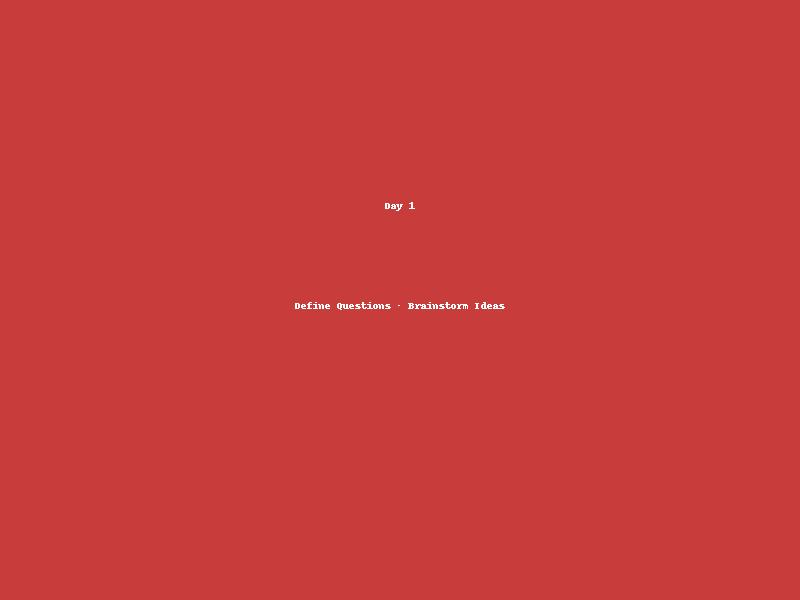
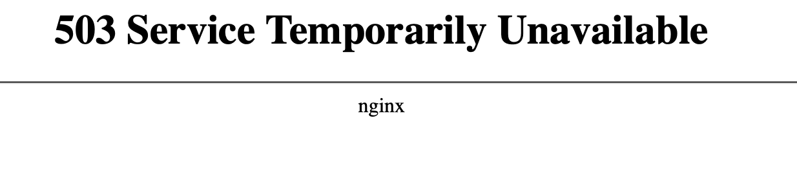
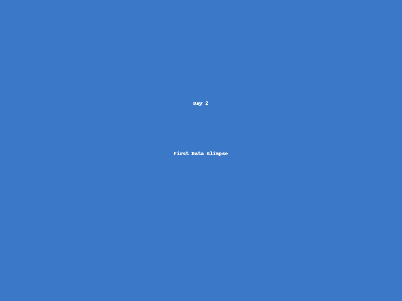
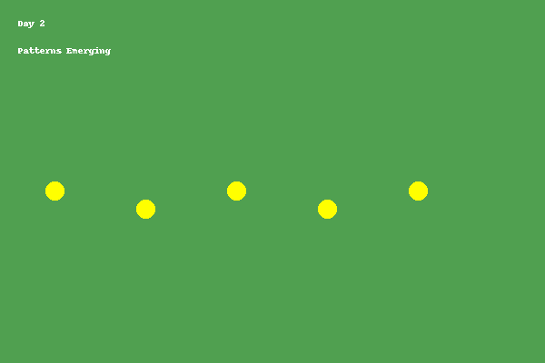
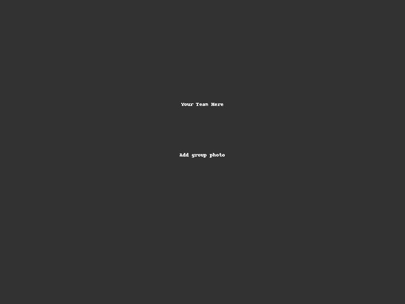
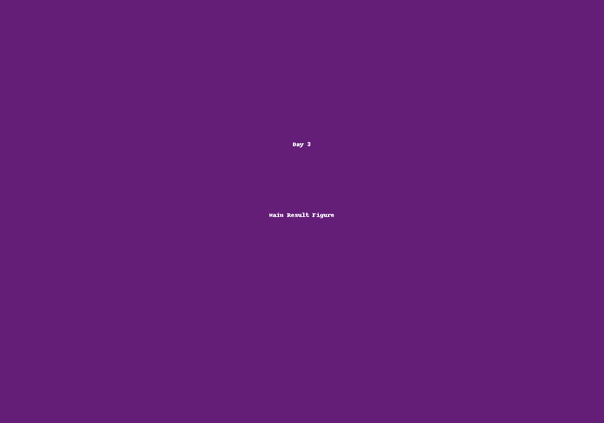

<a href="https://github.com/CU-ESIIL/Project_group_OASIS/edit/main/docs/index.md" title="Edit this page">✏️</a>

<!-- =========================================================
HERO (Swap hero.jpg, title, strapline, and the three links)
========================================================= -->

[Raw photo location: hero.jpg](https://github.com/CU-ESIIL/Project_group_OASIS/blob/main/docs/assets/hero.jpg)

# Project Sprint: Clear, Short Title

**One sentence on impact:** In 3 days, we explore *X* to inform *Y*, producing actionable visuals, a concise brief, and shareable code.

**[Project brief (PDF)](#) · [View shared code](code.md) · [Data & access](data.md)**

> **About this site:** This is a public, in-progress record of a 3-day project at the Innovation Summit. Edit everything here in your browser: open a file → pencil icon → Commit changes.

---

## How to use this page (for the team)
- **Edit this file:** `docs/index.md` → ✎ → change text → **Commit changes**.
- **Add images:** upload to `docs/assets/` and reference like `assets/your_file.png`.
- Keep **text short** and **visuals first**. Think “slide captions,” not essays.

---

## Day 1 — Define & Explore
*Focus: questions, hypotheses, context; add at least one visual (photo of whiteboard/notes).*

### Our question(s)
<!-- EDIT: Replace bullets with your own. Encourage divergent takes. -->
- What are we trying to understand or change?
- Why now? Why here?
- Who benefits if we succeed?

### Hypotheses / intentions
<!-- EDIT: Plain language, short and honest. -->
- We think that …
- We intend to test whether …
- We will know we’re onto something if …

### Why this matters (the “upshot”)
<!-- EDIT: 2–3 sentences max, decision-oriented. -->
Explain who is impacted and how this could change decisions or understanding.

### Inspirations (papers, datasets, tools)
<!-- EDIT: Swap in your own links. -->
- Publication: [Influential paper title](https://doi.org/xxxx)
- Dataset portal: [Example data hub](https://example.org)
- Tool/tech: [Method or library](https://example.org)

### Field notes / visuals
<!-- EDIT: Replace with a real smartphone photo or sketch; keep filename simple. -->

[Raw photo location: day1_whiteboard.jpg](https://github.com/CU-ESIIL/Project_group_OASIS/blob/main/docs/assets/day1_whiteboard.jpg)
*Caption: What this shows and why it’s useful today.*

> **Different perspectives:** Briefly capture disagreements or alternate framings. These can unlock innovation.

---

## Day 2 — Data & Methods
*Focus: what we’re testing and building; show a first visual (plot/map/screenshot/GIF).*

### Data sources we’re exploring
<!-- EDIT: Link each source; add size/notes if relevant. -->
- **Source A**

  
[Raw photo location: explore_data_plot.png](https://github.com/CU-ESIIL/Project_group_OASIS/blob/main/docs/assets/explore_data_plot.png)
  *Snapshot showing initial data patterns.*

- Source B — link and 1-line description

### Methods / technologies we’re testing
- Approach 1 (e.g., time-series break detection)
- Approach 2 (e.g., random forest on features)
- Visualization (e.g., map tiles, small multiples)

### Challenges identified
- Data gaps / quality issues
- Method limitations / compute constraints
- Open questions we need to decide on

### Prototype visuals
<!-- EDIT: Swap examples; keep file sizes modest. -->
#### Static figure

[Raw photo location: figure1.png](https://github.com/CU-ESIIL/Project_group_OASIS/blob/main/docs/assets/figure1.png)
*Figure 1.* One line on what this suggests.

#### Animated change (GIF)

[Raw photo location: change.gif](https://github.com/CU-ESIIL/Project_group_OASIS/blob/main/docs/assets/change.gif)
*Figure 2.* One line on what changes across time.

#### Interactive map (iframe)
<iframe
  title="Study area (OpenStreetMap)"
  src="https://www.openstreetmap.org/export/embed.html?bbox=-105.35%2C39.90%2C-105.10%2C40.10&layer=mapnik&marker=40.000%2C-105.225"
  width="100%" height="360" frameborder="0"></iframe>

<a href="https://www.openstreetmap.org/?mlat=40.000&mlon=-105.225#map=12/40.0000/-105.2250">Open full map</a>

> If an embed doesn’t load, put the normal link directly under it.

---

## Day 3 — Insights & Sharing
*Focus: synthesis; highlight 2–3 visuals that tell the story; keep text crisp.*

[Raw photo location: team_photo.jpg](https://github.com/CU-ESIIL/Project_group_OASIS/blob/main/docs/assets/team_photo.jpg)

### Findings at a glance
<!-- EDIT: 2–4 bullets, each a headline in plain language with a number if possible. -->
- Headline 1 — what, where, how much
- Headline 2 — change/trend/contrast
- Headline 3 — implication for practice or policy

### Visuals that tell the story
<!-- EDIT: Swap visuals; prioritize clarity. -->

[Raw photo location: main_result.png](https://github.com/CU-ESIIL/Project_group_OASIS/blob/main/docs/assets/main_result.png)
*Figure 3.* What this shows and why it matters.

<iframe
  title="Short explainer video (optional)"
  width="100%" height="360"
  src="https://www.youtube.com/embed/dQw4w9WgXcQ"
  frameborder="0" allow="accelerometer; autoplay; clipboard-write; encrypted-media; gyroscope; picture-in-picture; web-share"
  allowfullscreen></iframe>

### What’s next?
- Immediate follow-ups
- What we would do with one more week/month
- Who should see this next

---

## Featured links (image buttons)
<!-- EDIT: Replace images/links; keep alt text meaningful and motion subtle. -->
<table>
<tr>
<td align="center" width="33%">
  <a href="#"> <strong>Read the brief</strong></a>
</td>
<td align="center" width="33%">
  <a href="code.md"> <strong>View code</strong></a>
</td>
<td align="center" width="33%">
  <a href="data.md"> <strong>Explore data</strong></a>
</td>
</tr>
</table>

---

## Team
| Name | Role | Contact | GitHub |
|------|------|---------|--------|
| Jane Doe | Lead | jane.doe@example.org | @janedoe |
| John Smith | Analyst | john.smith@example.org | @jsmith |

---

## Cite & reuse
If you use these materials, please cite:

> Lastname, A., Lastname, B. (2025). *Project title*. DOI or URL.

License: CC-BY-4.0 unless noted. See dataset licenses on the **[Data](data.md)** page.

---

<!-- EDIT HINTS
- Upload images to docs/assets/ and reference as assets/filename.png
- Keep images ~1200 px wide; avoid >5–8 MB per file.
- Use short, active sentences; this is a scrolling “slide deck.”
- Update this page at least once per day during the sprint.
-->
